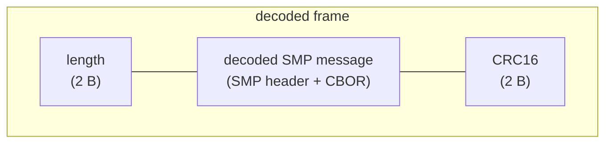
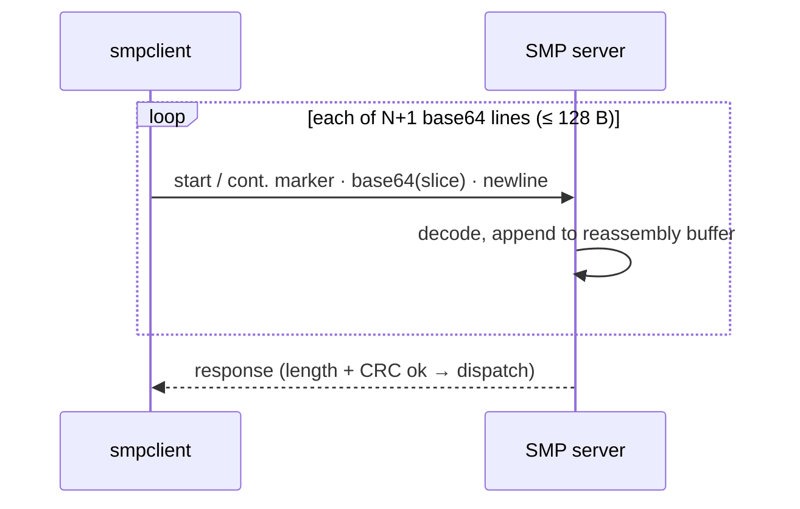

# Simple Management Protocol (SMP) Client

`smpclient` implements the transport layer of the Simple Management Protocol.  This library can be
used as a dependency in applications that use SMP over **serial (UART or USB)**, **Bluetooth (BLE)**,
or **UDP** connections.  Some abstractions are provided for common routines like upgrading device
firmware.

If you don't need a library with the transport layer implemented, then you might prefer to use
[smp](https://github.com/JPHutchins/smp) instead.  The SMP specification can be found
[here](https://docs.zephyrproject.org/latest/services/device_mgmt/smp_protocol.html).

If you'd like an SMP CLI application instead of a library, then you should try
[smpmgr](https://github.com/intercreate/smpmgr).

## Install

`smpclient` is [distributed by PyPI](https://pypi.org/project/smpclient/) and can be installed with `uv`, `pip`, and other dependency managers.

Build with all transports:

```
smpclient[all]
```

Or none (UDP transport only):

```
smpclient
```

Or build with only the transports you need:

```
smpclient[serial] # Serial (UART, USB, CAN)
smpclient[ble] # Bluetooth Low Energy
smpclient[serial,ble] # Serial + BLE
```

The UDP transport has no additional dependencies and is always available.

## User Documentation

Documentation is in the source code so that it is available to your editor.
An online version is generated and available [here](https://intercreate.github.io/smpclient/).

## Server Buffers & SMP Serial Fragmentation

Choosing the right fragmentation for the **serial** transport (UART/USB/CAN/etc.) requires
understanding the buffers in the firmware on the other end. The two SMP servers we
target name the same concepts differently, and the docs/Kconfig on each side are
easy to misread, so this section unifies the terminology. (BLE and UDP negotiate
their MTU directly and need none of this.)

### The SMP serial frame

A serial SMP transaction is one **decoded frame**: a 2-byte length and a 2-byte
CRC16 wrap the SMP message — and that wrapped message is exactly what the BLE and
UDP transports send bare.



For the **serial** transport that whole frame is base64-encoded and split into
≤ 128-byte (configurable as "line length", but it should always be left at 128) lines on the wire. The server base64-**decodes each line as it arrives**
and appends it to a single reassembly buffer — it never holds the whole encoded frame
at once (mcuboot
[`boot_serial_in_dec`](https://github.com/mcu-tools/mcuboot/blob/4ae65047c628365c30ec9a48eb0433169dc4f7ef/boot/boot_serial/src/boot_serial.c#L1460-L1490);
Zephyr
[`mcumgr_serial_decode_frag`](https://github.com/zephyrproject-rtos/zephyr/blob/a65b87f2c6d5961b105193bd94058e523d6df54f/subsys/mgmt/mcumgr/transport/src/serial_util.c#L48-L64)):



So the buffer that actually limits a transaction holds the **decoded** frame, and:

> **max SMP message = (reassembly buffer size) − 4**  (the 2-byte length + 2-byte CRC16).

That message becomes **~1.37×** as many bytes once base64-encoded and split into
≤ 128-byte lines (base64's 4/3 expansion plus per-line framing). A server that
advertises a 2048-byte buffer therefore accepts a 2044-byte message that arrives as a
**2801-byte, 23-line** encoded frame. The advertised/configured number is the
*decoded* size — **not** the size of the encoded frame on the wire.

### Terminology (mcuboot vs. Zephyr)

| Role | Bounds | Enc/Dec | mcuboot symbol (default) | Zephyr symbol (default) |
| --- | --- | --- | --- | --- |
| **Line buffer** | one base64 line on the wire | encoded | [`BOOT_MAX_LINE_INPUT_LEN`](https://github.com/mcu-tools/mcuboot/blob/4ae65047c628365c30ec9a48eb0433169dc4f7ef/boot/zephyr/Kconfig.serial_recovery#L76) (128) | [`UART_MCUMGR_RX_BUF_SIZE`](https://github.com/zephyrproject-rtos/zephyr/blob/a65b87f2c6d5961b105193bd94058e523d6df54f/drivers/console/Kconfig#L226) (128) |
| **Fragment pool** | queued unprocessed lines (throughput only — *not* a frame-size cap) | — | [`BOOT_LINE_BUFS`](https://github.com/mcu-tools/mcuboot/blob/4ae65047c628365c30ec9a48eb0433169dc4f7ef/boot/zephyr/Kconfig.serial_recovery#L84) (8) | [`UART_MCUMGR_RX_BUF_COUNT`](https://github.com/zephyrproject-rtos/zephyr/blob/a65b87f2c6d5961b105193bd94058e523d6df54f/drivers/console/Kconfig#L233) (2) |
| **Reassembly buffer** | the whole message + 4 B framing — *the real ceiling* | decoded | [`BOOT_SERIAL_MAX_RECEIVE_SIZE`](https://github.com/mcu-tools/mcuboot/blob/4ae65047c628365c30ec9a48eb0433169dc4f7ef/boot/zephyr/Kconfig.serial_recovery#L91) (1024) → [`dec_buf`](https://github.com/mcu-tools/mcuboot/blob/4ae65047c628365c30ec9a48eb0433169dc4f7ef/boot/boot_serial/src/boot_serial.c#L164) | [`MCUMGR_TRANSPORT_NETBUF_SIZE`](https://github.com/zephyrproject-rtos/zephyr/blob/a65b87f2c6d5961b105193bd94058e523d6df54f/subsys/mgmt/mcumgr/transport/Kconfig#L40) (384) |
| **Advertised `buf_size`** (MCUmgr params, OS group cmd 6) | what a client should target | decoded | *not advertised yet* ([mcuboot#2746](https://github.com/mcu-tools/mcuboot/pull/2746)) | = `NETBUF_SIZE` |
| **Transport "MTU"** | mostly response framing / advisory | — | [`BOOT_SERIAL_FRAME_MTU`](https://github.com/mcu-tools/mcuboot/blob/4ae65047c628365c30ec9a48eb0433169dc4f7ef/boot/boot_serial/src/boot_serial.c#L131) (124, TX only) | [`MCUMGR_TRANSPORT_UART_MTU`](https://github.com/zephyrproject-rtos/zephyr/blob/a65b87f2c6d5961b105193bd94058e523d6df54f/subsys/mgmt/mcumgr/transport/Kconfig.uart#L27) (256, *registered but unused on UART*) |

Two traps the table is meant to defuse:

- The **fragment pool count** (`BOOT_LINE_BUFS` / `UART_MCUMGR_RX_BUF_COUNT`) is a
  throughput queue — buffers are recycled as lines are decoded — and does **not**
  bound the frame size. The decoded **reassembly buffer** does. (mcuboot's Kconfig
  help suggests `MAX_RECEIVE_SIZE = line_len × line_bufs`, conflating the two; the
  code sizes `dec_buf` to `MAX_RECEIVE_SIZE` *decoded* regardless.)
- Zephyr's `MCUMGR_TRANSPORT_UART_MTU` reads like the send/receive limit, but its
  `get_mtu` is never called on the UART path; the real incoming limit is `NETBUF_SIZE`.

The **128-byte line** is a convention, not negotiated: both servers cap a line and
discard the overflow ([mcuboot](https://github.com/mcu-tools/mcuboot/blob/4ae65047c628365c30ec9a48eb0433169dc4f7ef/boot/zephyr/serial_adapter.c#L160-L165),
[Zephyr](https://github.com/zephyrproject-rtos/zephyr/blob/a65b87f2c6d5961b105193bd94058e523d6df54f/drivers/console/uart_mcumgr.c#L110-L118)),
so clients must fragment at ≤ 128 (smpclient's default). Don't change it.

### How smpclient targets these

`SMPSerialTransport` fills the decoded reassembly buffer for best throughput. The
`fragmentation_strategy` chooses how it learns the buffer size — `Auto` (default, from
MCUmgr params), `BufferSize` (named directly, when params are unavailable such as mcuboot
serial recovery), or `BufferParams` (a constrained encoded line-buffer budget). See the
[Serial transport API docs](https://intercreate.github.io/smpclient/transport/serial/)
for when to use each.

This is exercised against real native_sim / QEMU / mps2 Zephyr servers in the
integration suite (`tests/integration/`): a `buf_size − 4` message round-trips while
putting ~1.37× `buf_size` encoded bytes on the wire, across the buffer-size matrix.

## Development Quickstart

> Assumes that you've already [setup your development environment](#development-environment-setup).

Tasks are defined in [`tasks.py`](tasks.py) and run with [camas](https://github.com/JPHutchins/camas) — the same definitions drive local development and CI, so running a task locally reproduces CI exactly. Run `uv run camas --list` to see every task.

1. run `uv sync` when pulling in new changes
2. run `uv run camas fix` after making changes (fast)
3. run `uv run camas all` after making changes (thorough)
4. add library dependencies with `uv`:
   ```
   uv add <my_new_dependency>
   ```
5. add test or other development dependencies:
   ```
   uv add --group dev <my_dev_dependency>
   ```
6. run tests for all supported python versions:
   ```
   uv run camas matrix
   ```

## Development Environment Setup

### Install Dependencies

- uv: https://docs.astral.sh/uv/getting-started/installation/

### Create the venv

```
uv sync
```

### Verify Your Setup

```
uv run camas all
```

### Enable the githooks

```
git config core.hooksPath .githooks
```
